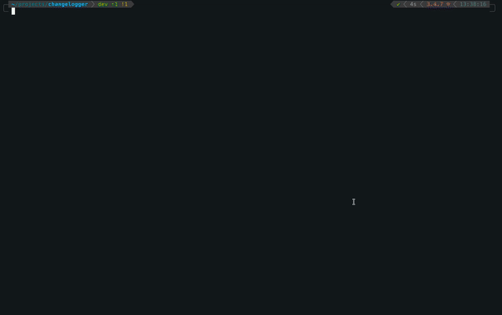

# Changelogger

A tiny TUI and CLI to build CHANGELOGs from your git history. Browse your git graph on the left, pick "anchor" commits
that mark minor releases, and watch a live preview on the right. Press Enter to write CHANGELOG.md. Or, use the
non-interactive CLI in scripts.

- Left pane: git log graph with htop-style scrolling
- Right pane: live preview of the generated CHANGELOG
- Anchor selection -> versions: 0.1.0, 0.2.0, ... with evenly spaced patches in between
- Colorful highlighting, persistent help bars, comfy terminal UX
- Headless CLI mode for CI/scripts

Works best on macOS/Linux terminals. Windows users: try WSL.

* [Changelogger](#changelogger)
    * [Demo](#demo)
    * [Install](#install)
    * [Usage](#usage)
        * [Interactive (TUI)](#interactive-tui)
        * [Non-interactive (CLI for scripts/CI)](#non-interactive-cli-for-scriptsci)
    * [Versioning algorithm](#versioning-algorithm)
    * [Output format](#output-format)
    * [Library (programmatic)](#library-programmatic)
    * [UI details](#ui-details)
    * [Requirements](#requirements)
    * [Documentation](#documentation)
    * [Troubleshooting](#troubleshooting)
    * [Contributing](#contributing)
    * [License](#license)

## Demo



## Install

Gemfile:

```ruby
gem "changelog-builder"
```

Then:

```shell
bundle install
```

Or install globally:

```shell
gem install changelog-builder
```

## Usage

### Interactive (TUI)

From a git repository (or pass a repo path/URL):

```shell
# Current repo
changelogger

# Local path
changelogger ../some_dir/project

# GitHub slug
changelogger rails/rails

# Full URL
changelogger https://github.com/rails/rails.git
changelogger git@github.com:rails/rails.git
```

- Move (left): Up/Down or j/k
- Select anchors: Space
- Toggle fit: f (show entire selected commit block if it fits)
- Refresh graph: r
- Resize split: < and >
- Switch focus: Tab / Shift-Tab
- Scroll preview (right): Up/Down, PgUp/PgDn, g/G
- Generate: Enter (writes CHANGELOG.md)
- Quit: q or ESC (exits quietly)
- z: toggle zebra striping
- The frame titles show which repo you’re working in:
    - Left title: `Graph — <repo_name> [<branch>@<short_sha>*]`, where `*` indicates uncommitted changes
    - Right title: `Preview — <remote slug>` (e.g., owner/repo) or repo name if no remote
- Visual separators:
    - A thin dotted line appears at commit boundaries (without overwriting the graph)
    - Zebra striping per commit block helps scanning; toggle with z

The `.graph` cache is regenerated automatically; use r to refresh.

### Non-interactive (CLI for scripts/CI)

Generate a CHANGELOG without the TUI. You must provide at least 2 anchors (SHAs, tags, or branches). REPO can be a local
path, GitHub slug, or git URL.

```shell
# Write CHANGELOG.md in current repo
changelogger --generate --anchors v1.0.0,v1.1.0

# Write to custom file
changelogger --generate --anchors abc1234,def5678 -o HISTORY.md

# Run against another repo (local path)
changelogger --generate --anchors v1.0.0,v1.2.0 ../some/project

# Run against a GitHub repo (slug or URL)
changelogger --generate --anchors v7.0.0,main rails/rails
changelogger --generate --anchors a1b2c3d,deadbeef https://github.com/user/repo.git

# Print to stdout (no file)
changelogger --generate --anchors v1.0.0,v1.1.0 --dry-run
```

Options:

- `--generate`, `-g`: Non-interactive mode
- `--anchors x,y,z`: Anchors (2+). Each token can be a full/short SHA, tag, or branch name
- `--output PATH`, `-o PATH`: Output file (default: CHANGELOG.md)
- `--major N`: Major version (default 0)
- `--minor-start N`: Minor start index (default 1 -> 0.1.0, 0.2.0, ...)
- `--base-patch N`: Patch spacing base (default 10)
- `--dry-run`: Print to stdout

Exit codes:

- 0: Success
- 1: General error
- 2: Invalid arguments (e.g., insufficient anchors)

## Versioning algorithm

"Semantic-ish" mapping:

- Major stays 0 by default (configurable)
- Minor increments per anchor: 0.1.0, 0.2.0, 0.3.0, ...
- In-between commits get patches spaced over 1..base (default 10):
    - `patches[i] = round((i+1) * base / (k+1))` with monotonic fixups
    - 1 between -> 0.1.5
    - 2 between -> 0.1.3, 0.1.7
    - 3 between -> 0.1.3, 0.1.5, 0.1.8

## Output format

Each selected commit (anchors and in-between) gets:

- Section: "## [x.y.z] - YYYY-MM-DD"
- Bullet: "- <subject> (<short_sha>)"
- Commit body is included and indented
- A top "## [Unreleased]" section is always present

## Library (programmatic)

Use the building blocks directly:

```ruby
require "changelogger"
# or just require "changelogger"

commits = Changelogger::Git.commits
anchors = ["abc1234", "def5678"] # full or short SHAs, or resolve with `git rev-parse`

# Preview as a string:
puts Changelogger::ChangelogGenerator.render(commits, anchors, base_patch: 12)

# Or write:
Changelogger::ChangelogGenerator.generate(commits, anchors, path: "CHANGELOG.md", major: 1, minor_start: 0)
```

Note:

- `require "changelogger"` only loads the module/version (no TUI).
- For the TUI specifically: require "changelogger/tui".

## UI details

- Side-by-side layout with color highlighting
- Help bars at the top of each pane
- htop-like scrolling in the graph pane
- "Fit selected commit" avoids cutting blocks at the bottom (toggle with f)
- .graph is auto-regenerated; press r to refresh

## Requirements

- Ruby 3.0+
- Git installed
- POSIX terminal (colors recommended)
- Linux/macOS tested; Windows via WSL recommended

## Documentation

Code is covered with YARD notation. All docs could be accessed from separate
page https://unurgunite.github.io/changelog-builder_docs/

## Troubleshooting

- Tab doesn’t switch focus: try Shift-Tab; ensure TERM is set (e.g., xterm-256color)
- No colors: falls back to bold/standout
- Not a git repo: pass a repo path/slug/URL
- Cancel in TUI: exits quietly (no "not enough commits" message)

## Contributing

PRs welcome. Please keep changes focused and include reproduction steps or a short clip for UI tweaks.

## License

MIT © 2021–present unurgunite, SY573M404
